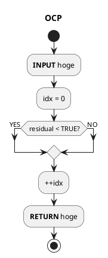

# autogenu design

TODO

## autogenu Requirement

TODO

## Generating autogenu Candidate Path

TODO

### Preparation phase

TODO

### Flow chart

The following charts illustrate the flow of the OCP

## Parameters

### Essential parameters

The following parameters are configurable in `hoge`.

| Name                        | Unit | Type    | Description                             | Default value |
| :-------------------------- | ---- | ------- | --------------------------------------- | ------------- |
| `hoge` | [-]  | boolean | Hoge               | true          |

### Debug

The following parameters are configurable

| Name                   | Unit | Type    | Description                  | Default value |
| :--------------------- | ---- | ------- | ---------------------------- | ------------- |
| `debug_param` | [-]  | boolean | Flag to output debug data | false         |

## Future Improvements

- 

## References

TODO
